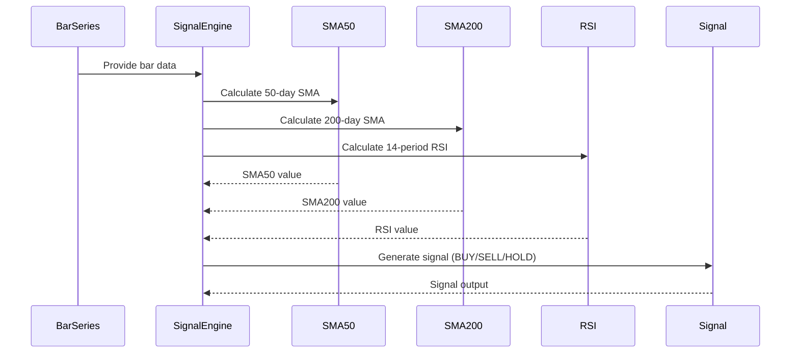

# Signal Logic Documentation

## Trend+RSI Strategy for TSLA

- **Indicators**:
  - 50-day Simple Moving Average (SMA50)
  - 200-day Simple Moving Average (SMA200)
  - 14-period Relative Strength Index (RSI)

- **Entry Rule**: BUY when SMA50 > SMA200 AND RSI < 40 (Oversold condition indicating potential bullish reversal)

- **Exit Rule**: SELL when RSI > 70 (Overbought condition indicating potential bearish reversal)

- **Otherwise**: HOLD

## Implementations

- **Implementation A (TA4J Native)**: Uses TA4J BarSeries for data input, manual calculations for indicators and logic to ensure compatibility.

- **Implementation B (Pure Java Manual)**: Pure Java implementation with manual calculations for all indicators and logic.

- **Integrity Gate**: SignalValidator test ensures both implementations produce identical signals for the same input data.

## Sequence Diagram

## Performance Notes

The signal engine is designed to handle high-throughput processing up to 10,000 events/sec. Virtual Threads (available in Java 21 preview) can be utilized for concurrent signal generation if needed.

## Test Results

Referee tests passed: Both implementations produce identical signals, confirming functional integrity.
